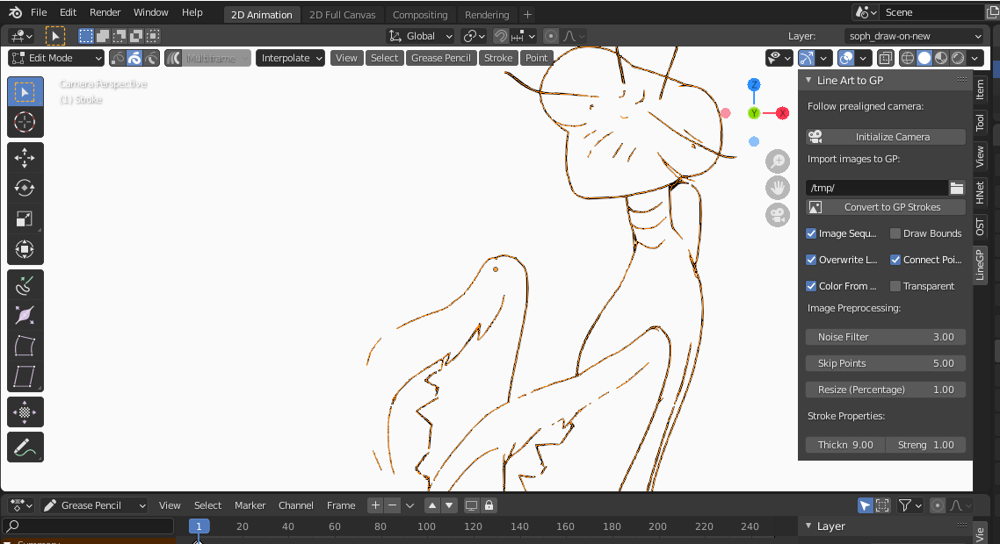

# lineart_to_gp

This is an add-on to generate Grease Pencil strokes based on line art from raster images (like PNG or JPG) with the appropriate thickness and thinness. This is kind of redundant with the work being done importing potrace now, but at the moment mine supports multiple colors and supports finer detail, so I figured I'd share while it might still be relevant!
NOTE: This uses scikit-image and won't work without it! Scroll down for installation instructions.

Some notes:

- You can sculpt the imported strokes, just like any you drew.

- The modifiers will also act on it appropriately. 

- It can import colors from line art. For best results, use transparent images and check off "Transparent." Otherwise, black and white images work fine.

- If you turn off "Colors From Lineart," it will use the active material instead.

- It takes longer to connect strokes, so turn them off for bigger images, but modifiers and color fill won't work for disconnected points.

- Use a Simplify or Smooth modifier to get rid of aliasing.

- There's an option to generate a Grease Pencil object parent to a prealigned camera. If you do a render with that camera (for example, to export line art generated with FreeStyle or an inverse hull), the image will be (approximately) aligned when you import it to the attached Grease Pencil object! You will probably have to hide the object in viewport to see the Grease Pencil behind it, though, since for resolution reasons the Grease Pencil object has to be a certain distance from the camera. Mess with Focal Length at your own risk.

- If you want to use a painterly brush, you'll probably want to use modifiers to simplify it, turn down the opacity, and scramble the UVs. Otherwise, it'll just be too dense.

- Totally unintentional, but you *can* use the line art algorithm for solid colors, too! It works pretty well for one solid color, but expect mixed results with multiple colors.

- Uses the hardness of the selected brush.

- Option to batch import an image sequence from a directory. Will automatically create a frame for each number appropriately.

- It's designed with 1920x1080 images in mind. The more lines there are, and the thinner those lines are, the longer it will take to process. A very simple image will take a few seconds, while a very complex one could take twenty or more.

- If an image is taking too long to import, you can turn off the "Connection" option, which will give you a bunch of disconnected points. Not a huge difference visually, but you won't be able to flood fill, and modifiers won't work.

- It takes color from the line art itself at the pixel level by default, but you can disable that to use the active material instead. You'll probably want to disable it for solid black lineart if there's a lot of antialiasing going on or it's low res, to avoid a lot of white/gray artifacts.

- If you're somehow still not getting enough detail, you can bring in a large image and just resize it, but that will take longer to process. 

---

- INSTALLATION

(Installation notes mostly for Windows, since I don't have a Mac, and if you're on Linux, you probably already know how to do this.)

To use this, you'll need to install scikit-image to Blender. To do that, you first need to go to the directory you've installed Blender to. In Windows, you can figure out where that is by right-clicking the shortcut to Blender and opening properties, then clicking the "Open File Location" button. (If you don't have a shortcut to Blender on your desktop, you can type "Blender" into the search and right-click on it to create one.)

Once you have the directory open in the file explorer, navigate to the "2.90" folder, then the "python" folder, and then the "bin" folder from there. (If on Linux, and possibly Mac, stay in the "python" folder.)

Once there, open the command line in that directory by going to File > Open PowerShell > Open Power Shell as administrator. (It won't work if you're not administrator for this.) Then, input the following two commands, one at a time:

bin/python -m ensurepip

bin/python -m pip install -t . scikit-image

On Linux (and probably Mac), you should still be in just the 2.90 folder, and the commands will be:

./python3.7m -m ensurepip

./python3.7m -m pip install scikit-image

After that, just install the add-on the way you would any other!
